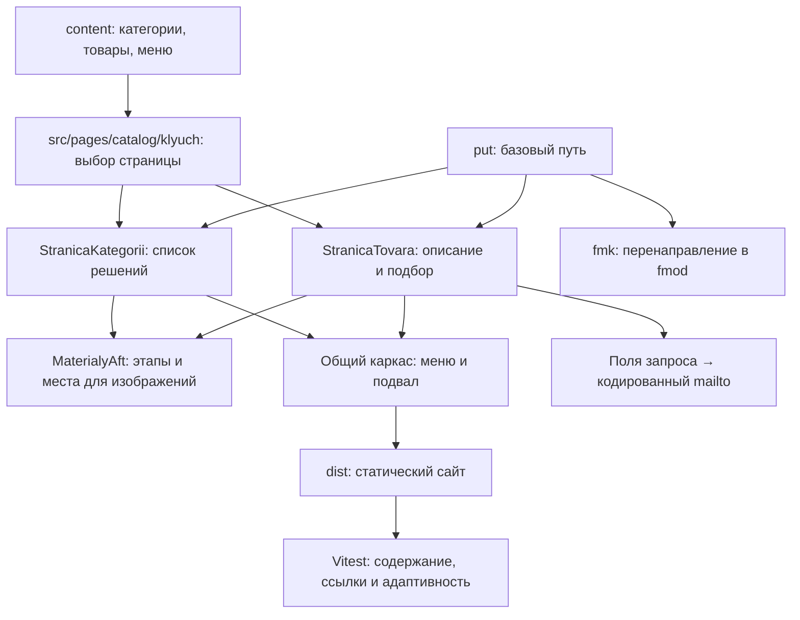

# Карта кода TAUBER

Актуализирована 06.10.2026. Сайт собирается Astro в статические страницы. Содержание хранится в отдельных JSON, изображения — в public/images. Изменения АФТ расширяют общие шаблоны необязательными полями.

## Модули и связи

| Модуль | Ответственность | Данные / потребители |
|---|---|---|
| src/pages/index.astro | Главная страница | Категории и отрасли из content |
| src/pages/catalog/[klyuch].astro | Статические маршруты категорий и товаров | JSON → общий шаблон |
| src/pages/catalog/fmk.astro | Сохранение старой ссылки | put('/catalog/fmod/') |
| src/lib/content.js | Общие данные сайта | Меню, главная, каркас |
| src/lib/put.js | Адреса с базой /tauber-web/ | Компоненты и страницы |
| src/components/StranicaKategorii.astro | Первый экран, карточки, пояснения | content/catalog/*.json |
| src/components/StranicaTovara.astro | Секции товара, материалы, запрос | content/tovary/*.json |
| src/components/MaterialyAft.astro | Упрощённые этапы; подписанные фото/рендеры | Не содержит производственных чертежей |
| tests/aft.test.js | Полнота десяти направлений, приватность документов, ссылки | Собранные HTML и исходные JSON |

## Модель содержания АФТ

Категория fmod содержит kartochki; поле vedyot_na — ключ товарной страницы. Товар ссылается назад через proizvodnyy_razdel. sekcii содержит текст или комплектацию с четырьмя группами: характеристики, состав схемы, контроль, варианты. normativ связывает технологическую задачу с рисунком и разделом ГОСТ. skhema задаёт shagi либо раздельные vetki. materialy включает места фото/рендера. podbor.tip='dannye' задаёт свободные поля; прежние товары сохраняют собственный формат подбора.

## Сквозные процессы и инварианты

- Сборка: JSON → статические маршруты → шаблоны → dist. Не вставлять строки с сериализованными объектами вместо объектов.
- Навигация: каждый внутренний путь проходит через put(). Стандартный slug fmod сохранён.
- Запрос: значения полей data-parametr собираются с подписями, пробелы обрезаются, тема и тело кодируются через encodeURIComponent. Кнопка открывает почтовую программу; отправку выполняет посетитель.
- Содержание: числовые параметры не выдумывать; нормативный состав системы отделять от границ поставки и дополнительных опций.
- Приватность: public и dist не должны содержать исходные ТУ, паспорта/РЭ или компоновочные чертежи.
- Проверка: `npm run build`, затем `npm test`; браузер 1280/768/390 px. Main публикуется автоматически, поэтому до просмотра владельца изменения остаются в отдельной ветке.
